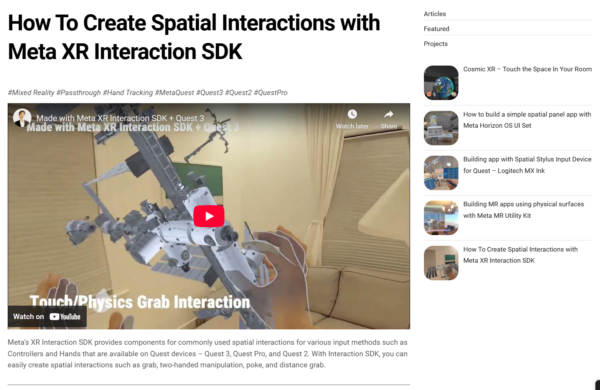
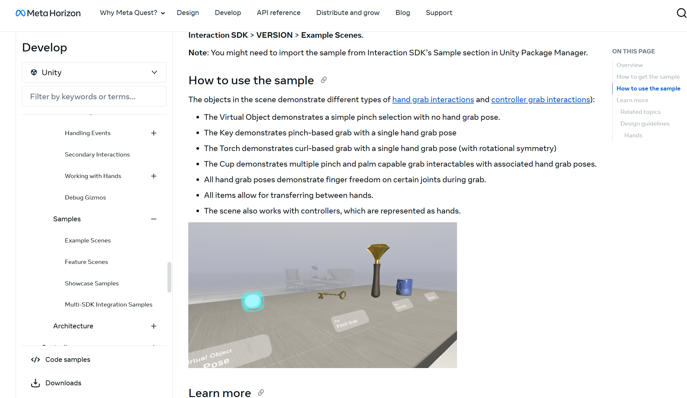
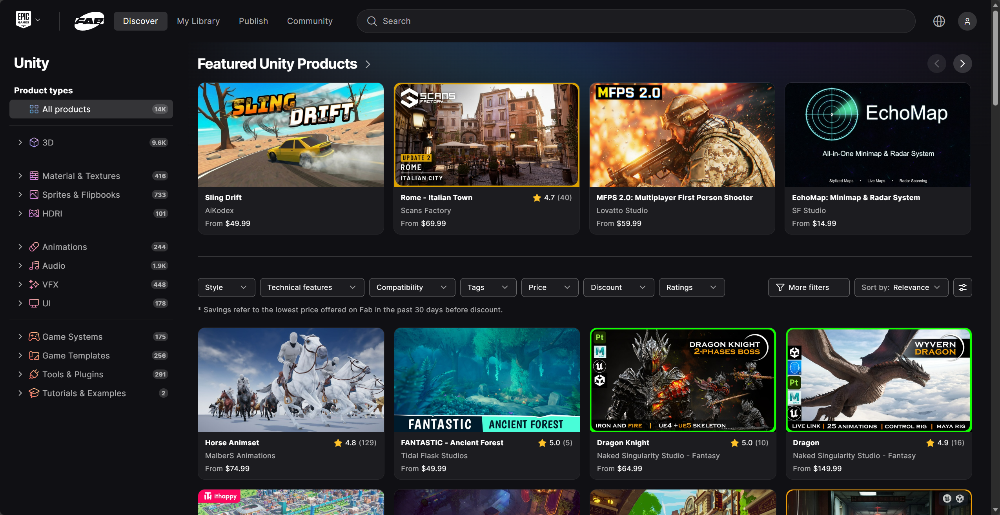
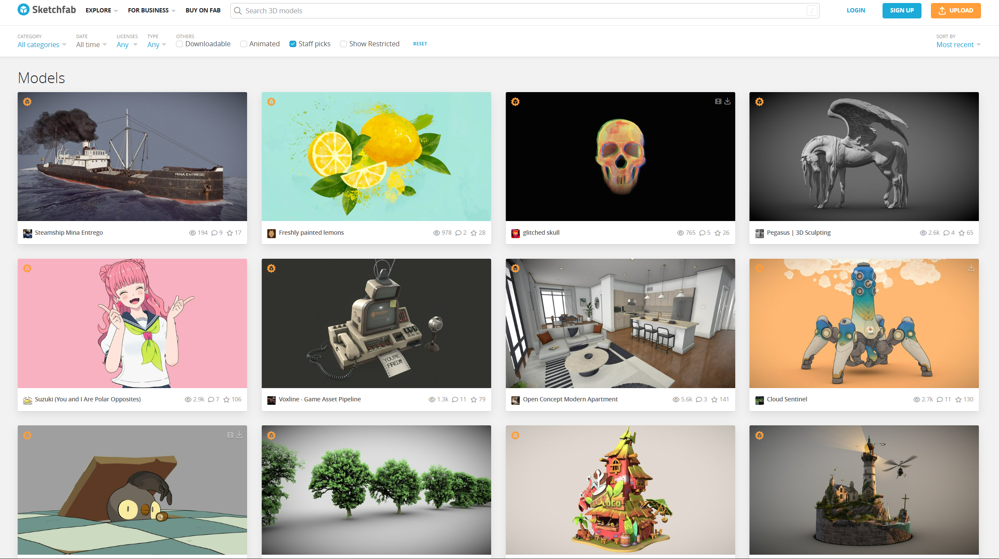

# Documentation

## Contents

### [XR Technology Overview](doc/xr-overview.md)
Learn about the history, classification, and application scenarios of XR technology.

### [Unity Basics](doc/unity-basics.md)
The basic operations and core concepts of the Unity engine.

### [Open XR and Design Principles](doc/openxr.md)
Get a review of spatial computing design principle including available interaction techniques and development kits.

### [Install Meta SDK](doc/helloworld.md)
Learn how to install and use Meta XR SDK in Unity right away.

## Userful Resources

> [How to start with Meta XR SDK (tutorial with video and example)](https://mixedrealitynow.com/getting-started-with-meta-xr-interaction-sdk-quest-3-how-to-crucial-interactions)
> 
> 

> [Meta XR Interaction SDK Example Online Documentation](https://developers.meta.com/horizon/documentation/unity/unity-isdk-example-scenes/#distancegrabexamples/)
> 
> 

>[Unity|Fab](https://www.fab.com/channels/unity)
>
> 
> 
> 
Fab is a unified marketplace for 3D assets and digital content.

> [Unity Asset Store](https://assetstore.unity.com/)
>
> 
> 
> 
The official store for Unity game engine assets, tools, and plugins.

> [Sketchfab](https://sketchfab.com/)
> 
> 
> 
> 
A platform to publish, share, and discover 3D, VR, and AR content.

