# Unity Hello World for Meta Quest VR headsets

This guide shows you how to set up Unity for Meta Quest virtual reality (VR) development. You’ll learn to:

* Set up a Unity 3D project that runs on Meta Quest VR headsets
* Add VR interactions to a Unity scene
* Preview your app on a Meta Quest VR device or computer

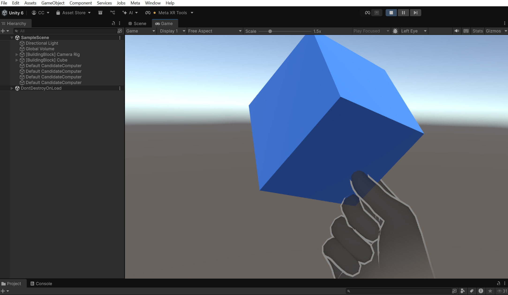

## Prerequisites

Before starting this tutorial, ensure you have the following:

**Hardware requirements**

* Development machine running one of the following:
* Windows 10+ (64-bit)
* macOS Sierra 10.10+ (x86 or ARM)

**Headset preview requirements**

To run Meta Horizon Link, an app that connects your headset and development machine, you must have the following:

* Windows 10+ 64-bit development machine with a compatible graphics card. See [Windows PC Requirements to use Meta Horizon Link](https://www.meta.com/help/quest/140991407990979/) for more information.
* Supported Meta Quest headsets:
    * Quest 2
    * Quest Pro
    * Quest 3
    * Quest 3S and 3S Xbox Edition

* Connection between your headset and development machine using one of the following:
    * USB-C data cable (*recommended*)
    * Wi-Fi connection, with both devices on the same network

* Android or iOS mobile device
    * [Meta Horizon mobile app](https://www.meta.com/help/quest/articles/getting-started/getting-started-with-quest-2/install-meta-horizon-mobile-app/)

> **Headset scene preview available only on Windows**
> To preview a scene in a headset, you must use the Meta Horizon Link app on a Windows machine to connect to the headset. To simulate the headset view on a macOS (ARM only) or Windows machine, install the [Meta XR Simulator](https://developers.meta.com/horizon/documentation/unity/xrsim-getting-started/) asset in your Unity project.

**Account requirements**

* Unity ID: [Create or log in to your Unity account](https://id.unity.com/)
* Meta Horizon developer account: [Register a Meta account](https://developers.meta.com/horizon/sign-up/)

---

## Step 1: Set up Unity Editor and assets

### Install Unity Hub

Unity Hub manages your Unity installations, tools, and projects in one place. Follow the installation steps below to install it:

1. Download Unity Hub from the [Download Unity](https://unity.com/download) website.
2. Open the Unity Hub installer and complete the installation.

### Install a Unity Editor

1. Open the Unity Hub app.
2. Select **Installs** from the left navigation bar, which displays the Unity Editor versions installed on your system.
3. Click **Install Editor** and choose Unity version **6.1** or later.
4. On the **Add module** screen, select the **Android Build Support** items in the **Platforms** section.

    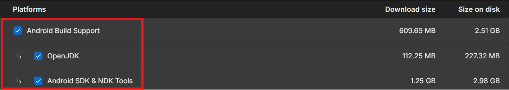

5. Click **Install**.

---

## Step 2: Set up your Unity 3D project

### Meta Quest Developer Hub XR project setup

> Optionally, you can use the Meta Quest Developer Hub app to generate a Unity 3D project. If you choose this option, skip this step and proceed directly to [Step 3: Add Building Blocks to your scene](https://www.google.com/search?q=%23step-3-add-building-blocks-to-your-scene). See [Create New XR Projects in MQDH](https://developers.meta.com/horizon/documentation/unity/ts-mqdh-xr-projects) for detailed instructions.

### Add Meta XR SDKs to your Unity account

1. Open a web browser and navigate to the [Unity Asset Store](https://assetstore.unity.com/).
2. Log into your Unity account and choose the organization that you selected for your project.
3. Open the following Unity Asset pages:
* [Meta XR Core SDK](https://assetstore.unity.com/packages/tools/integration/meta-xr-core-sdk-269169)
* [Meta XR Interaction SDK](https://assetstore.unity.com/packages/tools/integration/meta-xr-interaction-sdk-265014)
* [Meta XR Simulator](https://assetstore.unity.com/packages/tools/integration/meta-xr-simulator-266732)
* [Meta XR Platform SDK](https://assetstore.unity.com/packages/tools/integration/meta-xr-platform-sdk-262366)

4. On *each asset page*, click **Add to My Assets**. The following image shows the button for the Meta XR Core SDK:

    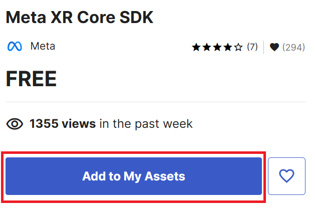

### Create a Unity project

Follow the steps below to create a new 3D Unity project in Unity Hub:

1. Select **Projects** in the left navigation bar, then click **New project**.

    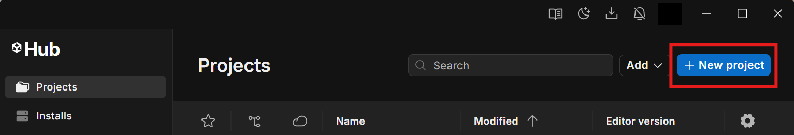

2. Select Unity Editor version **6.1** or later.
3. Select the **Universal 3D** template, an empty Unity 3D project built on the Universal Render Pipeline (URP).
4. Enter your project name, a save location, and a Unity organization.
5. Click **Create project**.

    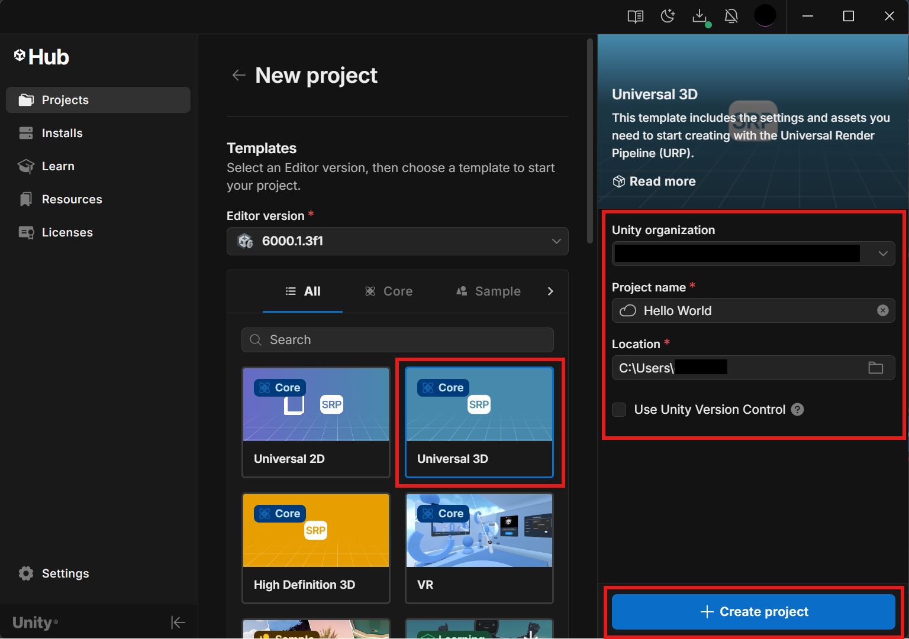

### Install the Unity OpenXR plugin

1. Select **Edit** > **Project Settings** from the Unity Editor menu.

    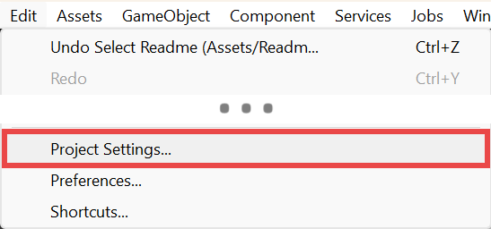
2. Select **XR Plug-in Management** on the left of the **Project Settings** window.
3. If XR Plugin Management is not installed, click **Install XR Plugin Management**.
    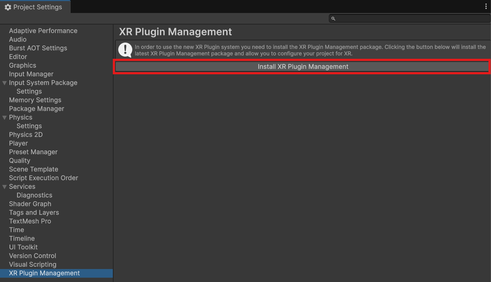
4. Check the **OpenXR** provider in the standalone group tab.
    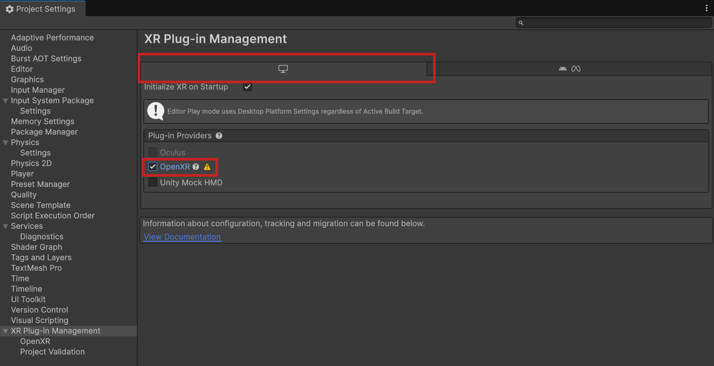
5. Check the **OpenXR** provider in the Meta group tab.
    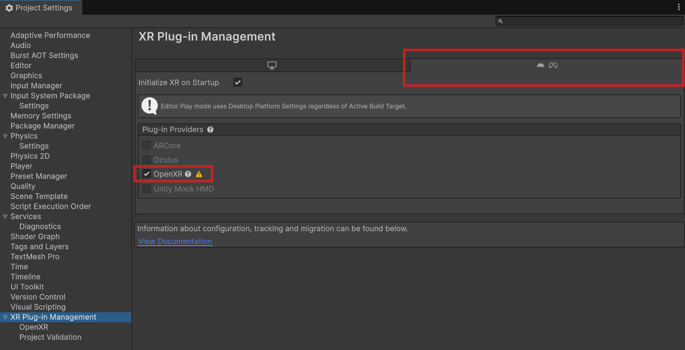

### Add and select the Meta Quest build platform

1. In the Unity editor menu, select **File** > **Build Profiles**.
2. Under **Platforms**, select **Meta Quest** and click **Enable Platform**. If you already installed the profile, click the **Switch Platform** button.
    
3. If prompted to install `com.unity.xr.openxr`, click **Install**.

> **Unity versions prior to 6.1**
> If the Meta Quest platform is absent from your version of Unity, select the **Android** build platform.

### Add Meta XR SDKs to your project

1. In the Unity Editor menu, select **Window** > **Package Management** > **Package Manager**.
    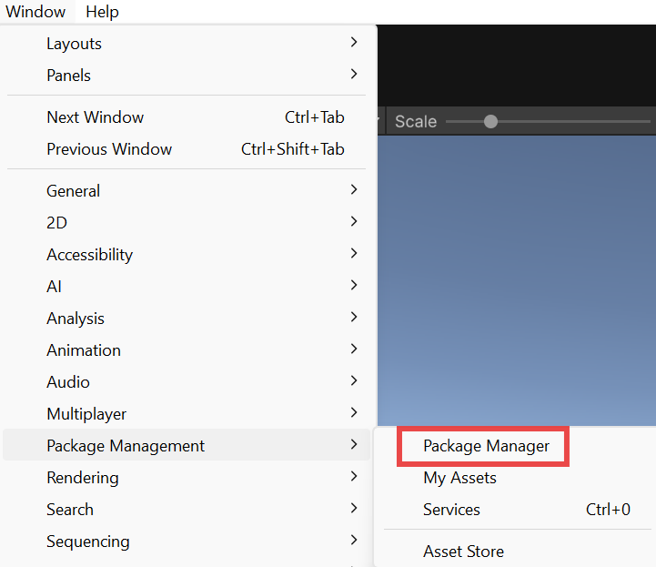
2. Select **My Assets** in the **Package Manager** window. The Meta XR assets you added from the Unity Asset Store should appear.
    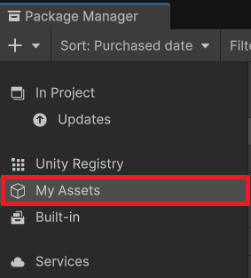
3. Select the **Meta XR Core SDK** and click **Install**.
    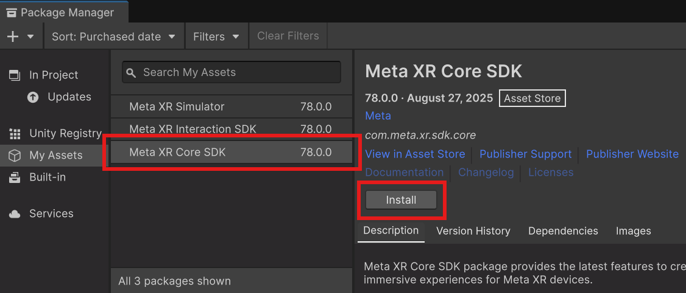
4. If prompted to enable the Meta XR feature set, select **Enable**.
    
    > If the feature set isn't enabled, activate it by navigating to **Edit** > **Project Settings**. Select **XR Plug-in Management** and make sure the **Meta XR Feature group** is checked in both the standalone and Meta group tabs.

5. When Unity prompts you to restart the Unity Editor, select **Restart Editor**.
    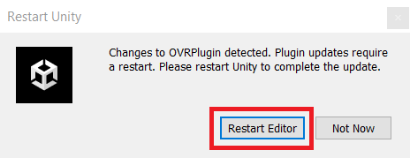
6. After the Unity Editor reopens, in the Package Manager window, select the **Meta XR Interaction SDK** and click **Install**.
    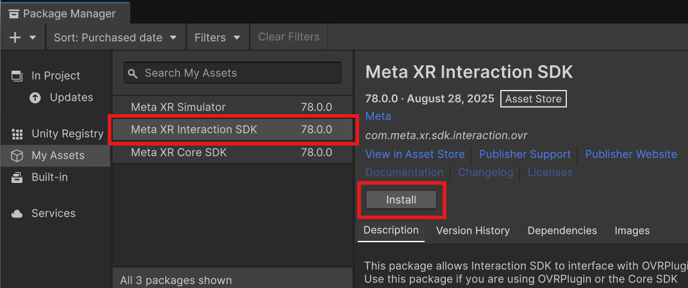
7. Unity prompts you about the Skeleton Upgrade, select **Use OpenXR Hand**.
    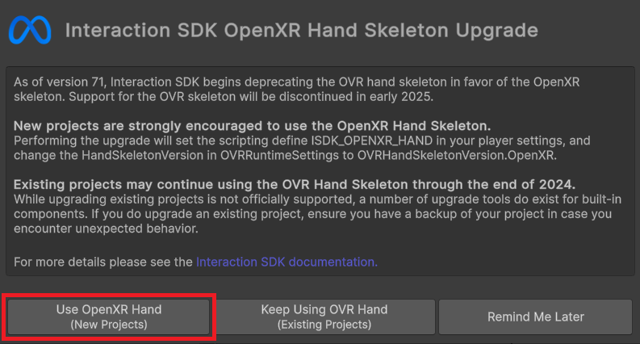
8. Select **Meta XR Simulator** and click **Install**.
    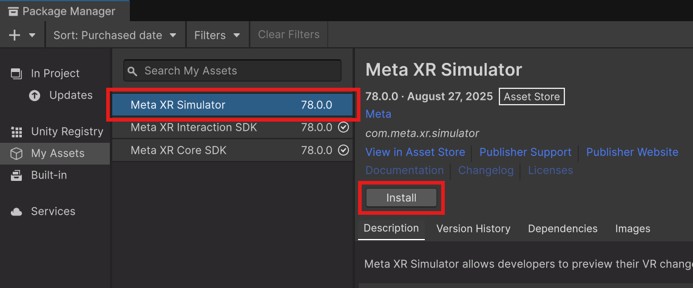

### Use the Project Setup Tool to update the configuration

1. From the top of the Unity Editor, expand the **Meta XR Tools** drop-down list, and then select **Project Setup Tool**.
    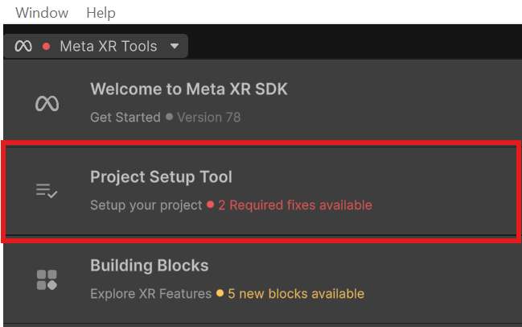
2. Click **Fix All** and **Apply All** in both the standalone and the Meta tabs.
    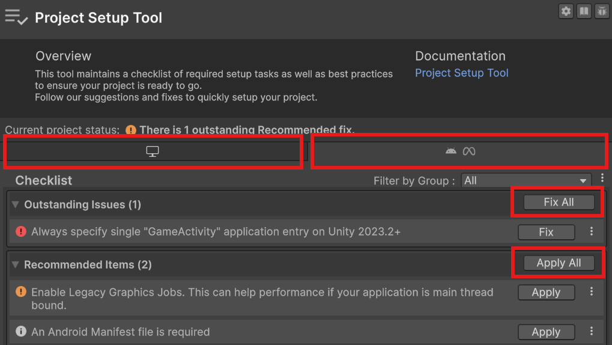

### Use Project validation to update the configuration

1. Navigate to **Project Settings** > **XR Plug-in Management** > **Project Validation**.
2. Click **Fix All** in both the standalone and the Meta tabs.
    

### Confirm OpenXR feature groups are selected

1. Navigate to **Project Settings** > **XR Plug-In Management** > **OpenXR** and select the Android tab.
2. Select **Meta XR** in the **OpenXR Feature Groups** section to filter the list.
3. Make sure the **Meta XR Feature**, **Meta XR Foveation**, and **Meta XR Subsampled Layout** are enabled.
    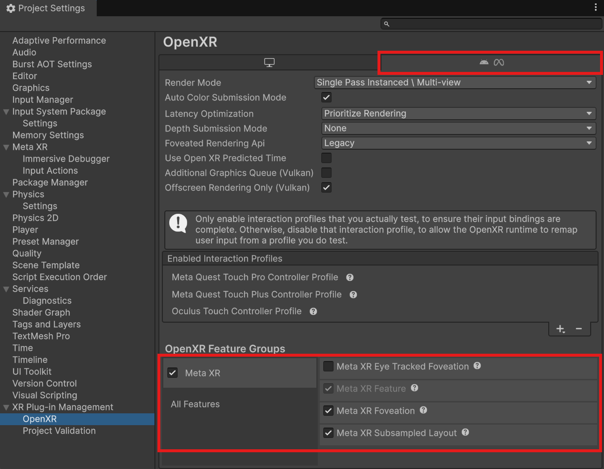

---

## Step 3: Add Building Blocks to your scene

Building Blocks are modular components included in Meta XR SDKs that you can use to quickly access Meta Quest features such as controller and hand tracking. Follow these steps to add Building Blocks to your scene:

### Add a camera rig

1. In the **Hierarchy** pane, delete **Main Camera** from your project’s **SampleScene**.
    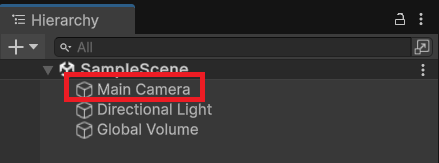
2. Select **Meta XR Tools** > **Building Blocks** from the drop-down toolbar menu in your editor.
    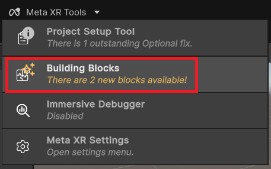
3. In the **Building Blocks** window, find the **Camera Rig** Building Block, and select the icon on the bottom right of the block to add it to your project.
    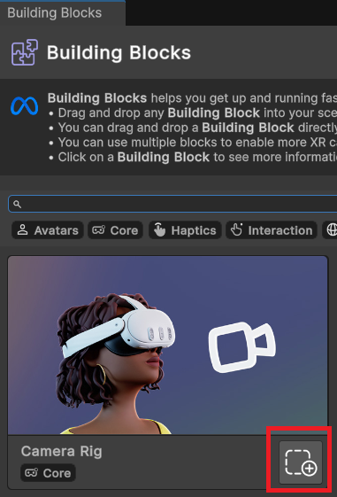
4. Verify that the Camera Rig object is in the **Hierarchy** pane.
    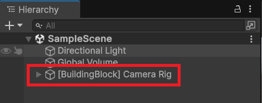

### Add a grab interaction

1. Select **Meta XR Tools** > **Building Blocks** from the drop-down toolbar menu in your editor.
2. In the **Building Blocks** window, find the **Grab Interaction** Building Block, and select the icon on the bottom right of the block to add it to your project.
    
3. Select **[BuildingBlock] Cube** in the **Hierarchy**.
    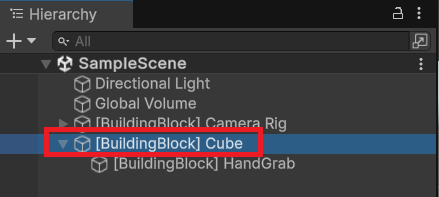
4. In the **Inspector**, under **Transform**, change the **Position** values to **(0, 1, 0.25)** to reposition it into view.
    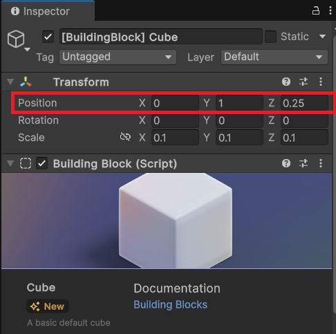

---

## Step 4: Preview your scene

If you lack the required hardware to preview the scene on a Meta Quest device, follow the steps in [Simulate Builds with XR Simulator](https://developers.meta.com/horizon/documentation/unity/xrsim-getting-started) to preview it on your computer. Otherwise, follow the steps below to preview your scene on your headset.

### Pair your headset with the Meta Horizon mobile app

1. On your mobile device, open the Meta Horizon app.
For instructions on installing the Meta Horizon mobile app, see [Install the Meta Horizon mobile app on your phone](https://www.meta.com/help/quest/articles/getting-started/getting-started-with-quest-2/install-meta-horizon-mobile-app/).
2. Sign in with your Meta developer account credentials through the app.
3. Pair your headset with the app.
4. Put on your headset and follow the instructions in the headset to finish the setup.

For detailed setup instructions and troubleshooting, refer to the [Getting started with your Meta Quest](https://www.meta.com/help/quest/articles/getting-started/) support page.

### Enable developer mode

1. On your mobile device, open the Meta Horizon app.
2. In the app, tap the hamburger menu (the icon with three horizontal lines) next to the search bar. Then, tap **Devices** and select your headset from the results.
**[Watch Video: Selecting Devices](https://scontent-gmp1-1.oculuscdn.com/v/t64.5771-25/491818916_1347773316801222_8126974667138582610_n.mp4%3F_nc_cat%3D101%26ccb%3D1-7%26_nc_sid%3D6500a6%26_nc_ohc%3D6FSwS7_-sZYQ7kNvwEBsAsg%26_nc_oc%3DAdlrN5xkd9Hw1aYy5MRhcVK5-LN__vQoGWBsCXPx-PAK9jQcOyuu938yvG5o-sIwLT0%26_nc_zt%3D28%26_nc_ht%3Dscontent-gmp1-1.oculuscdn.com%26oh%3D00_AftYbpn7tgUefmsURHSMgRAazBIndMJBdRiqab-RpfmlaQ%26oe%3D698F8C2B)**
3. Tap **Headset Settings** beneath the image of your headset.
4. Tap **Developer Mode**.
5. Turn on the **Developer Mode** toggle switch.
6. Use a USB-C cable to connect the headset to your computer.
7. Put on the headset.
8. In the headset, go to **Settings** > **Advanced** > **Developer**, and then enable **Enable custom settings** and **MTP Notification**.
9. When asked to allow USB debugging, select **Always allow from this computer**.

> **Important**
> Developer Mode is intended for development tasks such as running, debugging and testing applications. Engaging in other activities may result in account limitations, suspension, or termination. For more information, see [Content Guidelines](https://developers.meta.com/horizon/policy/content-guidelines/).

### Install Meta Horizon Link

1. [Download Meta Horizon Link](https://www.meta.com/help/quest/1517439565442928/) and install the app on your Windows machine.
2. Restart your machine if prompted by the installer.
3. Open the app.

### Connect your headset

1. Connect your headset to your computer using the USB-C cable.
2. Put on the headset. If you are prompted to start Link, click **Enable**.
3. If not prompted to start Link, open the universal menu and click the settings button. Then, click **Link**, ensure your PC is selected, and click **Launch**.

For a video on starting Link using either a USB-C cable or Air Link, see [Set up and connect Meta Horizon Link and Air Link](https://www.meta.com/help/quest/509273027107091/?srsltid=AfmBOooc6an4LhCbPJszboyHzvXWdb92F0roRE2KXWkRgL4ZV7BFEqyj).

### Interact with the scene on your headset

1. Click the **Play** button at the top of the Unity Editor.
2. Use your hand to grab the VR cube by making a pinching gesture.
3. Use your controller to grab the VR cube by using the grip button.

---

## Learn more

You have completed this tutorial and now have a Unity 3D project that you can use to develop apps for Meta Quest VR headsets. Continue your learning using the following resources:

* [Develop Unity apps for Meta Quest VR headsets](https://developers.meta.com/horizon/documentation/unity/unity-development-overview/): Essential components and topics to build, test, and debug your apps.
* [Introduction to Mixed Reality on Meta Quest](https://developers.meta.com/horizon/documentation/unity/mr-experience-and-use-cases/): Immersive modes and use cases.
* [Unity Sample Projects Overview](https://developers.meta.com/horizon/documentation/unity/unity-samples-overview/): Sample scenes, motifs, and showcase projects built by Meta engineers to help you create VR experiences in Unity.
* [Platform Solutions](https://developers.meta.com/horizon/documentation/unity/ps-platform-intro/): Social, multiplayer, and commerce tools you can integrate into your app by using the Platform SDK.
* [Meta XR Simulator Overview](https://developers.meta.com/horizon/documentation/unity/xrsim-intro/): Package that lets you preview your scene on your computer.
* [Meta Quest Developer Hub](https://developers.meta.com/horizon/documentation/unity/ts-mqdh/): App that manages devices, generates Unity projects, debugs apps, and submits them to the Meta Quest Store.