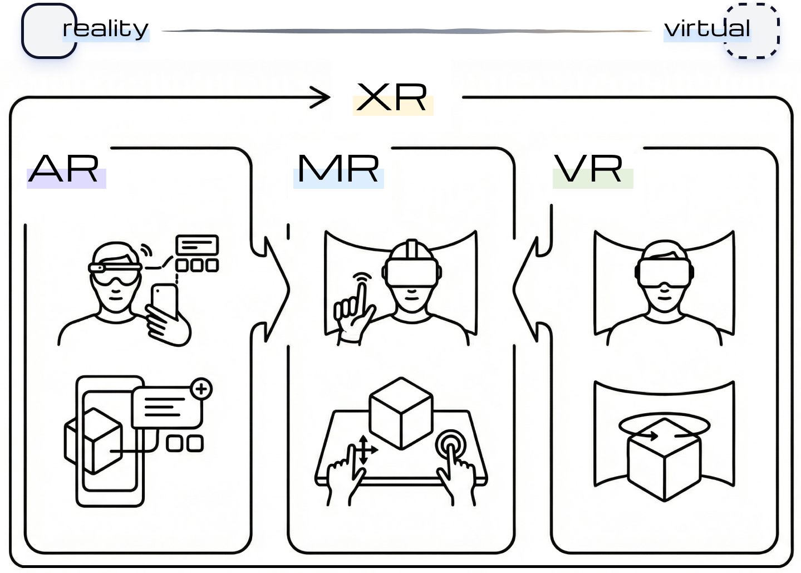
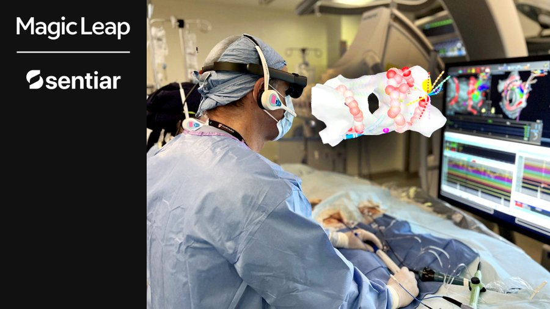
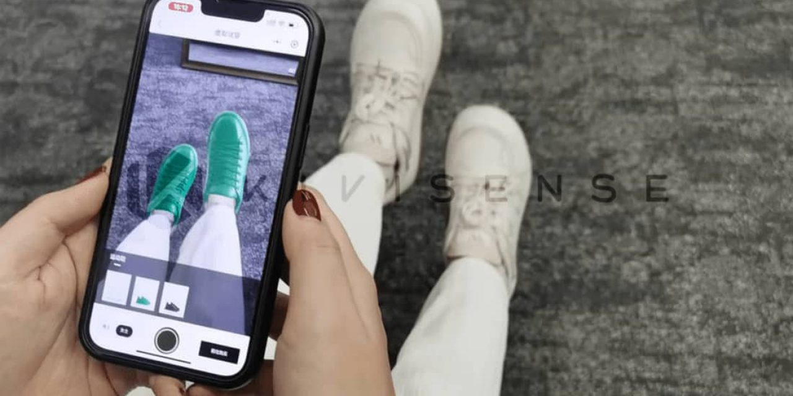
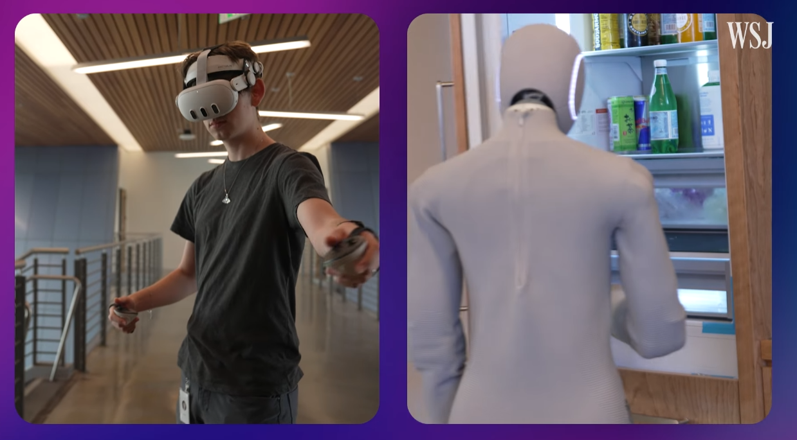
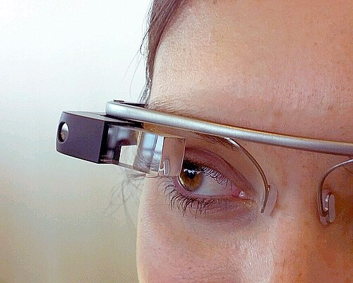
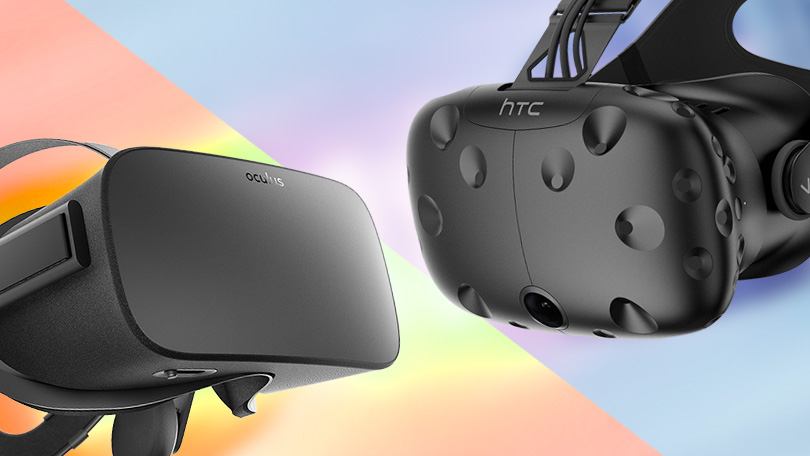
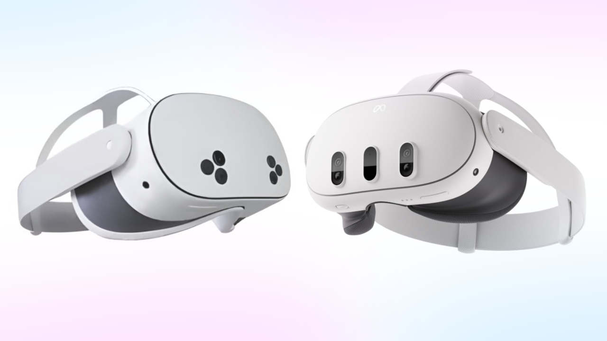
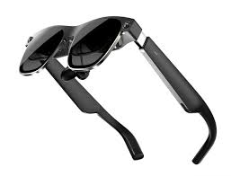
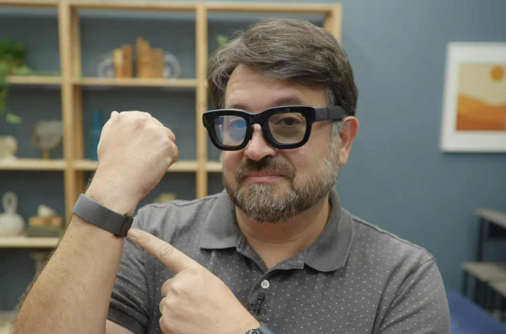

# XR Technology Overview

XR (Extended Reality) is the umbrella term for Virtual Reality (VR), Augmented Reality (AR), and Mixed Reality (MR).

## Landscape

As we transition from 2D screens toward spatial computing, understanding the terminology and technological underpinnings of immersive environments is essential. While the terms are often used interchangeably in casual conversation, these technologies represent specific points on the Reality-Virtuality Continuum—a framework that illustrates the span between the completely real environment and a completely virtual one.

XR serves as the foundational interface for the next generation of the internet (often referred to as the Metaverse). Rather than just viewing content on a screen, XR allows users to interact with 3D data in real-time, supported by technologies such as computer vision, AI, and spatial audio.

## VR, AR, and MR

To navigate this field, one must distinguish between the varying levels of immersion and interaction provided by different XR modalities.

**Virtual Reality (VR)** creates a fully simulated environment that replaces the user's physical surroundings. By utilizing specialized hardware such as Head-Mounted Displays (HMDs), VR isolates the user from the real world, immersing them in a computer-generated 3D space. While early iterations focused on gaming, modern VR is evolving to support complex social interactions and telepresence, aiming to shorten the psychological distance between physically remote users. High-fidelity VR relies on advanced rendering, six degrees of freedom (DoF) motion tracking, and volumetric capture to create believable experiences.

**Augmented Reality (AR)**, conversely, does not replace the physical world but enhances it. AR technologies overlay computer-generated imagery (CGI), such as text, video, or GPS data, onto the user's view of the real environment. This is most commonly experienced through smartphones or tablets, where the device's camera captures the real world and the screen displays the composite image. A key limitation of standard AR is that while it superimposes digital content, it often uses the real world merely as a static backdrop without deep spatial understanding or interaction.

**Mixed Reality (MR)** represents the convergence of the physical and virtual worlds. Unlike simple AR overlays, MR (sometimes called hybrid reality) anchors virtual objects to the real world, allowing for real-time interaction between physical and digital elements. MR devices constantly scan and interpret the physical environment, enabling digital content to interact with real-world structures—a capability essential for advanced industrial and medical applications where precise integration is required.

    Relationship of XR, AR, VR and MR. 
    Source: Bingru Li, 2026.

## XR Applications

In the healthcare sector, XR is used for both training and surgical execution. Surgeons utilize MR and VR to visualize 3D tissue data with high precision. Platforms like Medivis allow physicians to overlay a patient's internal anatomy (based on CT/MRI scans) directly onto their body in the operating room. This moves medical imaging from 2D screens into 3D space, improving surgical accuracy.

Source: Magic Leap, Youtube, 2024.

Source: Magic Leap (@magicleap), X, 2023.

Commercially, the Metaverse facilitates a digital economy where users can transact commodities using blockchain and Non-Fungible Tokens (NFTs). Retailers are leveraging AR to allow customers to visualize products, such as furniture or vehicles, in their own physical space before purchase. This "try-before-you-buy" model exemplifies how immersive tech is bridging the gap between digital marketing and physical reality.

    AR virtual shoe‑try‑on experience on the Bottega Veneta WeChat mini‑program, powered by KivuCube’s AR technology. 
    Source: KivuCube, “Bottega Veneta AR Virtual Shoe Try‑on Case,” KivuCube Blog, August 18, 2023
  

XR provides a new medium for preservation and education. The *Horizon of Khufu* experience, for example, allows visitors to virtually walk through the Giza Necropolis.

    The Horizon of Khufu experience allows visitors to stand atop the Great Pyramid and enjoy an unobstructed 360-degree view of Giza.  
    Source: Excurio
    

To achieve cinema quality visuals without the latency or compression artifacts typical of wireless streaming, this experience utilizes Location-Based VR (LBVR), where users carry wearable workstations (backpack PCs) to render graphics locally. This hardware setup powers a shared 'co-location' system, synchronizing the precise physical position of dozens of users into a single virtual environment to prevent collisions and enable social interaction, users are enabled to touch or walk to somewhere with controller to trigger plot events.

Current research indicates that the primary motivation for this shift extends beyond entertainment. As highlighted in recent studies on digital museums, technologies like Virtual Reality offer a solution to the limitations of physical sites—whether due to fragility, geographical distance, or, in the case of lost history, complete physical absence. By creating a Digital Twin of a heritage site, curators can democratize access, allowing students to explore sensitive archaeological areas without causing degradation to the original structure.

To achieve the hyper realistic visual fidelity seen in experiences like Horizon of Khufu, developers rely heavily on photogrammetry and handcrafting.

> **Photogrammetry**: A technology that extracts three-dimensional geometric information from two-dimensional images. In cultural heritage, this involves taking thousands of overlapping photographs of an artifact or site and using software to stitch them together into a highly detailed, textured 3D model.

However, the true value of XR in this domain lies in its psychological impact. Research published in Presence suggests that the effectiveness of these applications is measured by their ability to induce a sense of "being there." Unlike watching a documentary, a high fidelity VR experience leverages multisensory feedback to bridge the emotional distance between the viewer and the past.

Today, the research focus in the West is pivoting from merely displaying objects to storytelling. The challenge is no longer just technical rendering, but how to guide a user's attention in a 360 degree non-linear environment to ensure that the educational message is not lost in the spectacle.

In hazardous environments, such as space stations or nuclear facilities, VR-based teleoperation transforms how humans control robots. Instead of using abstract joysticks, operators wear VR headsets to manipulate robotic arms using natural hand movements.

This is particularly useful for controlling flexible manipulators (soft robots designed for confined spaces). To ensure safety, many systems use a Dual-Mode Architecture:

1. Indirect Mode: The operator performs the task in a simulation to verify the path is clear.
2. Direct Mode: The operator authorizes the physical robot to execute the verified movement.

However, real-time control faces significant technical hurdles. **Network Latency** remains a critical issue, where even millisecond delays can cause precision loss in high speed operations. Furthermore, users often struggle with the disconnect between moving a robot's base and manipulating its hands. Advanced techniques like **Redirected Walking**, which tricks the user's brain into perceiving infinite walking space within a small physical room, are being researched to make this mode-switching seamless.

> Start by experimenting with **Unity** or **ROS (Robot Operating System)** simulations using open-source robot models.

    User is teleoperating The 1X Neo using headset, it is one of the first humanoid robots. 
    Source: The Wall Street Journal, Youtube, 2025

## Devices: From Headsets to Spatial Computers

Understanding the hardware landscape is crucial for developers, as the capabilities of the device dictate the design of the experience.

### The Mobile Era (3DoF)
These devices laid the groundwork for today's industry but faced limitations in mobility or interaction.
*   **Google Cardboard & Gear VR:** These mobile-based viewers introduced millions to VR. They offered a **3DoF** (3-Degrees-of-Freedom) experience, allowing users to look around but not move through space. While accessible, they often caused motion sickness due to latency and lack of positional tracking.

    

    

        Google Cardboard. 
        Source: “Google Cardboard,” Google, 2016
    

*   **Google Glass:** One of the first consumer AR devices, featuring a monocular HUD (Heads-Up Display). It highlighted both the potential of information overlay and the social challenges of wearable cameras.

    

    

        Google Glass. 
        Source: “Google Glass,” Wikipedia, 2026
    

### The 6DoF VR
These headsets introduced 6DoF (6-Degrees-of-Freedom) to the consumer market. Users could walk, crouch, and use hands to interact with objects. However, they required powerful external computers and external sensors ("Lighthouses") to function.

*   **Oculus Rift & HTC Vive:** These PC-tethered headsets set the standard for high-fidelity VR gaming and simulation.

    

    

        HTC Vive vs Oculus Rift. 
        Source: “HTC Vive vs Oculus Rift,” Hydronic & Steam Equipment Co., Inc. 2026
    

> **Degrees of Freedom (DoF)**
>
> *   **3DoF (3-Degrees-of-Freedom):** Tracks rotational movement only (Pitch, Yaw, Roll). Users can look around like sitting in a swivel chair but cannot physically move their body through the virtual space.
> *   **6DoF (6-Degrees-of-Freedom):** Tracks both rotation and position (X, Y, Z). Users can walk, lean, and crouch, allowing for full interaction with the 3D world.
> 
> 
> 
> 

>     3DoF vs 6DoF. 
>     Source: “Degrees of Freedom,” Wikipedia, 2026
> 

### The Modern Standard: Standalone Mixed Reality
Today's development standard is the standalone headset, which processes everything on-board without wires.
*   **Meta Quest 3 / 3S:** Currently the market leader. These devices combine high-resolution VR with color **Passthrough** cameras, enabling Mixed Reality (MR) where virtual objects interact with the physical room. The Quest 3S ($299) democratizes this technology for mass adoption.

    

    

        Left: Meta Quest 3S Headset, Right: Meta Quest 3 Headset. 
        Source: “Meta Quest 3S and Meta Quest 3,” Meta, 2025
    

*   **Apple Vision Pro:** A premium "Spatial Computer" that eschews controllers in favor of eye-tracking and hand gestures. It focuses on high-resolution displays and seamless integration with existing 2D apps.

    

    

        Apple Vision Pro multitasking. 
        Source: Apple Vision Pro WWDC 2023, Apple, 2023
    

### Emerging Form Factors (Smart Glasses)
The future points toward lightweight, all-day wearables integrating AI.
*   **XREAL Air 2 Ultra:** AR glasses that project a virtual screen for productivity, prioritizing portability over full immersion.

    

    

        XREAL Air 2 Ultra. 
        Source: “XREAL Air 2 Ultra,” XREAL, 2025
    

*   **Meta Orion:** Devices that integrate AI assistants. While some (like Ray-Ban) lack a display, others (like the Orion prototype) aim to overlay holographic interfaces onto the real world without the bulk of a VR headset.

    

    

       Meta's AR glasses moonshot, Orion, has its own neural input wristband. 
    Celso Bulgatti/CNET, 2024
    

*   **Ray-Ban Meta Smart Glasses:** Audio-first wearables without displays that use multimodal AI to capture and analyze the world around the user.

## Technical and Ethical Challenges

Despite the potential, widespread adoption of XR and the Metaverse faces significant hurdles.

**Infrastructure and Latency:** To feel "real," XR requires ultra-low latency. If the delay between a user's movement and the visual response exceeds 20 milliseconds, it can cause "motion sickness." High-fidelity cloud streaming requires robust 5G or Wi-Fi 6E infrastructure to handle the data load.

**Hardware Constraints:** Current XR devices face a trade-off between power and portability. Standalone headsets offer freedom of movement but have limited processing power compared to tethered PC systems. Furthermore, to achieve social acceptance, HMDs must become lightweight and comfortable for extended use, overcoming issues related to bulk and battery life.

**Ethics and Privacy:** As the Metaverse captures intimate biometric data—potentially including gaze tracking and brain-computer interface (BCI) signals—privacy concerns are paramount. The immersive nature of these platforms also introduces new ethical dilemmas regarding identity theft, the spread of misinformation, and the regulation of user behavior in virtual spaces. There is currently a lack of unified moral rules or legislation to govern these decentralized virtual societies.

**Health Implications:** The phenomenon of "cyber-syndrome," a physical and mental condition stemming from excessive internet immersion, may be exacerbated by the blurring lines between the real and virtual worlds. Designers must prioritize ergonomic software design to minimize cognitive load and physical discomfort.

## Future Outlook

The trajectory of XR points toward a future where the distinction between the physical and digital becomes increasingly porous. By 2030, advancements in **Brain-Computer Interfaces** (BCIs) and **haptic technology** could allow for the tracking and sharing of human memories and sensory experiences. As major technology firms invest billions in developing the infrastructure for these "Microverses," the ultimate goal remains a decentralized, interoperable ecosystem where users can move seamlessly between virtual worlds, carrying their digital assets and identities with them.

---

References

[1] Dileep Kumar Murala; Sandeep Kumar Panda, "The Role of Immersive Reality (AR/VR/MR/XR) in Metaverse," in Metaverse and Immersive Technologies: An Introduction to Industrial, Business and Social Applications , Wiley, 2023, pp.159-189, doi: https://doi.org/10.1002/9781394177165.ch6

[2] Meta, "What's the difference between AR, VR and MR?", Feb 14 2024, https://forwork.meta.com/blog/difference-between-vr-ar-and-mr/

[3] Sydney Leslie, "The Key Role Of VR In Preserving Cultural Heritage", Arts Management & Technology Laboratory at Carnegie Mellon University,  May 6, 2022, https://amt-lab.org/blog/2022/4/motivating-usages-of-virtual-reality-in-cultural-heritage

[4] Z. Xiao and Y. Deling, "The “Hyper-Presence” of Cultural Heritage in Shaping Collective Memory," in Presence, vol. 27, no. 1, pp. 107-135, March 2019, doi: https://10.1162/pres_a_00321.

